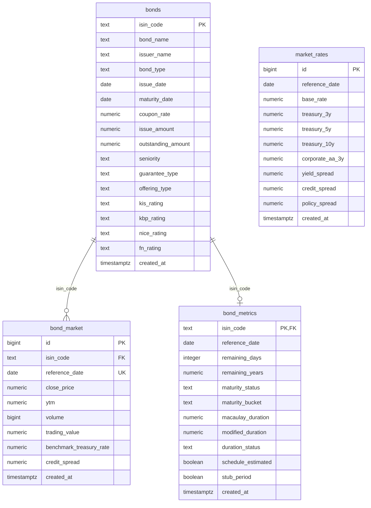

# Bond Insight Database ERD

이 문서는 Bond Insight 서비스에서 실제 사용하는 Supabase PostgreSQL `public` 스키마를 정의한다.
Raw CSV 전체를 저장하지 않고, 정제된 채권 기본정보·시장정보·파생지표·시장금리만 저장한다.

## ERD



`market_rates`는 개별 채권이 아니라 날짜별 전체 채권시장 환경을 나타내므로 다른 테이블과 직접 FK로 연결하지 않는다.

## 테이블 관계

| 부모 | 자식 | 관계 | 연결키 | 의미 |
|---|---|---|---|---|
| `bonds` | `bond_market` | 1:N | `isin_code` | 한 채권은 날짜별 시장정보를 여러 건 가질 수 있다. |
| `bonds` | `bond_metrics` | 1:0..1 | `isin_code` | 한 채권은 현재 기준 파생지표를 최대 한 건 가진다. |
| 없음 | `market_rates` | 독립 | `reference_date` | 날짜별 기준금리, 국고채 금리 및 시장 Spread를 저장한다. |

`bond_market`과 `bond_metrics`는 서로 직접 FK를 갖지 않는다. 두 테이블의 데이터가 필요할 때 Backend가 공통 `isin_code`를 기준으로 결합한다.

## 키와 제약조건

| 테이블 | Primary Key | Foreign Key | Unique/Index |
|---|---|---|---|
| `bonds` | `isin_code` | 없음 | 채권 조회의 기준키 |
| `bond_market` | `id` | `isin_code → bonds.isin_code` | `unique(isin_code, reference_date)`, ISIN·기준일 인덱스 |
| `bond_metrics` | `isin_code` | `isin_code → bonds.isin_code` | 잔존만기·Modified Duration 인덱스 |
| `market_rates` | `id` | 없음 | 날짜순 조회에 `reference_date` 사용 |

`bond_market`의 ERD 표기에서 `reference_date UK`는 단독 UNIQUE가 아니라 `isin_code`와 함께 구성되는 복합 UNIQUE의 일부를 뜻한다.

## 파생지표 정의

| 컬럼 | 정의 |
|---|---|
| `yield_spread` | 국고채 10년 금리 − 국고채 3년 금리 |
| `credit_spread` (`market_rates`) | 회사채 AA- 3년 금리 − 국고채 3년 금리 |
| `policy_spread` | 국고채 3년 금리 − 한국은행 기준금리 |
| `benchmark_treasury_rate` | 개별 채권 잔존만기에 맞춰 3·5·10년 국고채 금리를 보간한 값 |
| `credit_spread` (`bond_market`) | 개별 채권 YTM − 비교 국고채 금리 |
| `remaining_years` | 기준일과 만기일 간 일수 ÷ 365.25 |
| `macaulay_duration` | 채권 현금흐름 현재가치의 가중평균 회수기간 |
| `modified_duration` | YTM 변화에 대한 채권가격 민감도 |

## 실제 적재 현황

2026-08-12 검증 기준 서비스 데이터는 다음과 같다.

| 테이블 | 서비스 데이터 | 비고 |
|---|---:|---|
| `bonds` | 29,088건 | Supabase에는 기존 테스트 행 1건이 추가로 남아 총 29,089건 |
| `market_rates` | 2,858건 | Supabase에는 기존 테스트 행 1건이 추가로 남아 총 2,859건 |
| `bond_market` | 358건 | 원본 359건 중 기본정보가 없는 `KR381003GD86` 제외 |
| `bond_metrics` | 29,088건 | Duration 정상 계산 247건, 나머지는 계산 상태로 사유 보존 |

## 보안과 접근

- 공개 스키마 테이블은 RLS를 활성화한다.
- `anon`, `authenticated` 역할은 서비스 조회만 허용한다.
- 적재와 갱신은 Backend 전용 Supabase Secret Key로만 수행한다.
- Secret Key는 `.env`에만 저장하고 Frontend 또는 Git 저장소에 노출하지 않는다.

## 데이터 적재

재적재는 프로젝트 루트에서 다음 명령으로 수행한다.

```powershell
python -u src\loading\upload_supabase.py --table all
```

테이블별 재적재도 지원한다.

```powershell
python -u src\loading\upload_supabase.py --table bonds
python -u src\loading\upload_supabase.py --table market_rates
python -u src\loading\upload_supabase.py --table bond_market
python -u src\loading\upload_supabase.py --table bond_metrics
```

업로드는 기존 데이터를 삭제하지 않는다. 고유키가 있는 테이블은 upsert하고, `market_rates`는 기존 기준일을 제외한 행만 추가한다.
